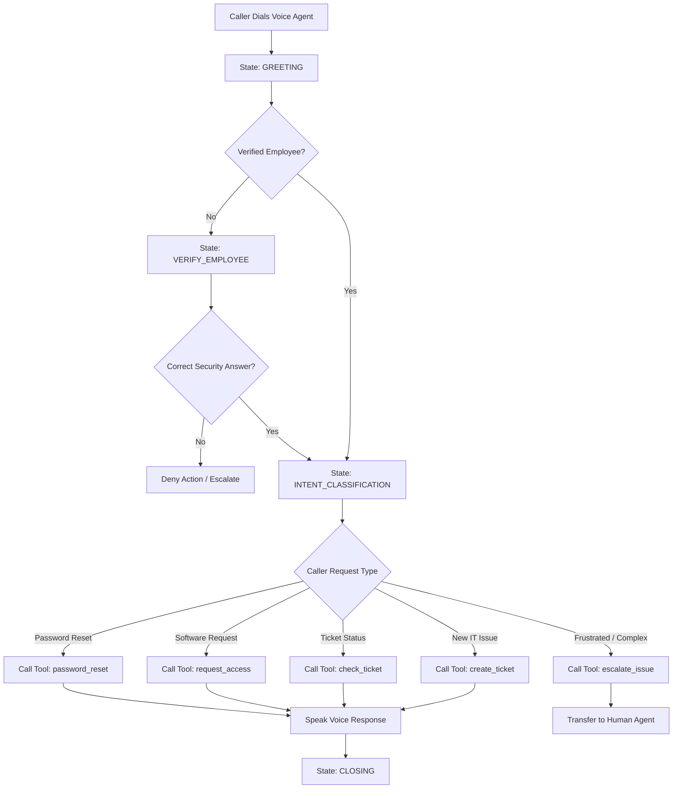

# Phase 10: Conversation Design & System Playbooks

## Phase Goal
The goal of Phase 10 is to design the **Conversational Persona, Prompt Engineering, and Dialogue State Transitions** for the **AI Voice IT Helpdesk Agent**. A voice agent's success relies heavily on conversation design: how it greets callers, verifies identity, asks clarifying questions, handles ambiguity, and gracefully handles fallbacks.

In this phase, we author the Master System Prompt (`playbooks/system_prompt.txt`), build structured state transition maps (`playbooks/conversation_flows.json`), and design the Voice Interaction Flow Diagram (`diagrams/voice_interaction_flow.mermaid`).

---

## Concepts Introduced

### 1. Voice Prompt Engineering vs Text Prompt Engineering
- **Text Chatbots**: Can output bullet points, code blocks, URLs, and long paragraphs.
- **Voice Agents**: Must output brief (1-2 sentence) responses written in natural spoken language. Bullet points, markdown formatting, and URL links must be converted into natural speech directives (e.g. "I have emailed the reset link to your inbox" instead of printing the URL).

### 2. Context Window & Persona Guardrails
The **Master System Prompt** establishes the agent's identity, tone, authority boundaries, and instruction hierarchy:
1. **Persona**: Calm, professional, empathetic, and concise IT Helpdesk Specialist named "Alex".
2. **Identity Guard**: Never claim to be human; clearly state that you are an AI IT Helpdesk Assistant.
3. **Safety Guard**: Never reveal raw passwords, database connections, or admin keys over phone audio.

### 3. Dialogue State Machine
Conversations transition through explicit states:
```
[GREETING] -> [IDENTITY_VERIFICATION] -> [INTENT_CLASSIFICATION] -> [TOOL_EXECUTION] -> [CONFIRMATION] -> [CLOSING]
```

---

## Free-Tier Notes

- **Zero Prompt Engineering Costs**: Prompt design artifacts, state machine JSONs, and Mermaid diagrams are local documentation files requiring no paid services.

---

## Folder Walkthrough

```
AI-Voice-IT-Agent/
├── docs/
│   ├── Phase-01.md
│   ├── Phase-02.md
│   ├── Phase-03.md
│   ├── Phase-04.md
│   ├── Phase-05.md
│   ├── Phase-06.md
│   ├── Phase-07.md
│   ├── Phase-08.md
│   ├── Phase-09.md
│   └── Phase-10.md            # This documentation file
├── playbooks/
│   ├── system_prompt.txt      # Master ElevenLabs / GPT System Prompt
│   ├── conversation_flows.json# Structured dialogue state machine
│   ├── tool_definitions.json  # OpenAI tool schemas
│   └── elevenlabs_agent_config.json # ElevenLabs playbook config
└── diagrams/
    └── voice_interaction_flow.mermaid # Voice interaction decision tree
```

---

## Voice Interaction Flow Diagram (`diagrams/voice_interaction_flow.mermaid`)



---

## What Was Learned & What Is Next

### Summary of What Was Learned:
- How prompt engineering for voice differs fundamentally from text models.
- How to design state machines for multi-turn conversational agents.
- How to enforce security guardrails in system prompts.

### What Will Be Implemented Next:
In **Phase 11**, we will build the **Intelligent Human Escalation System**. We will create sentiment score evaluation algorithms, priority calculators, and insertion into `escalation_logs` for Tier-2 support handoff.
